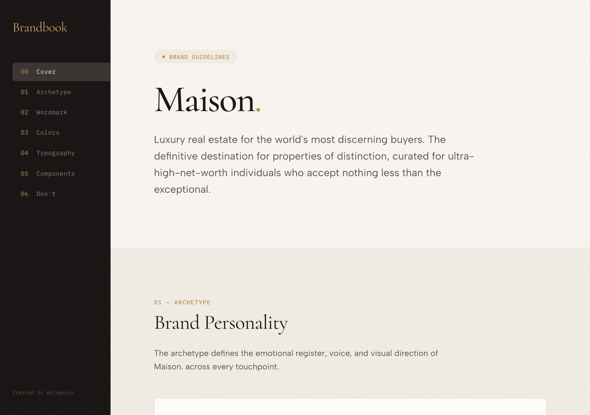
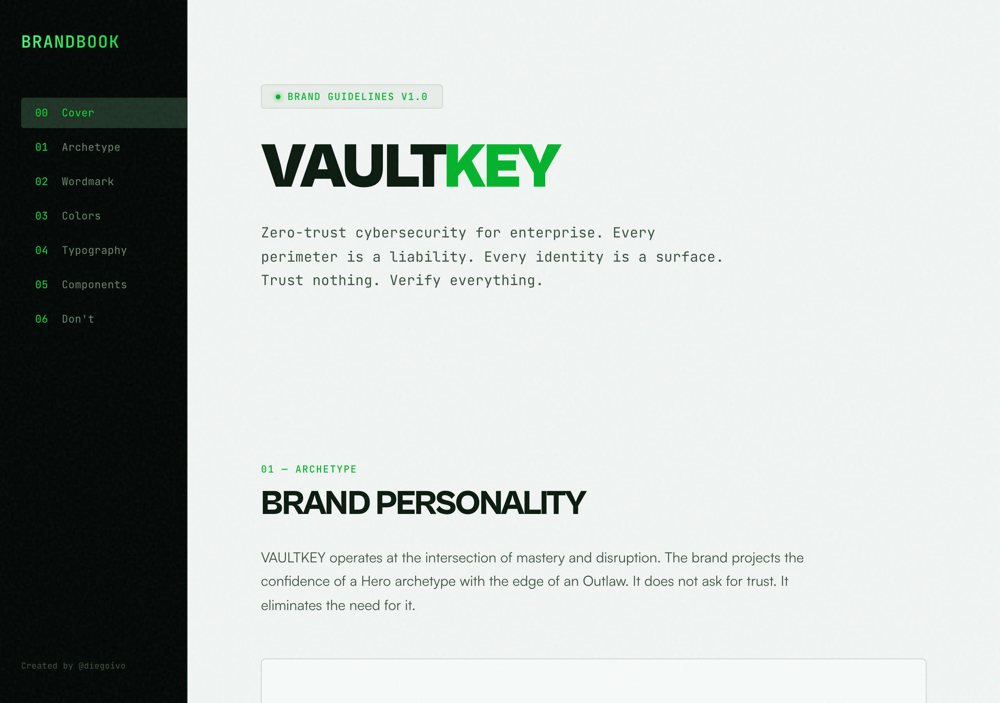
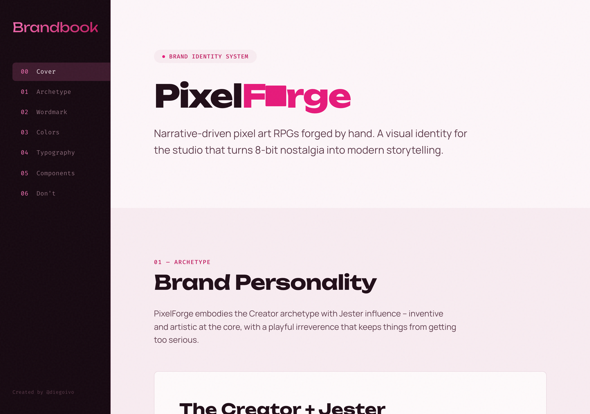

# Brandbookfy

A Claude Code skill that creates professional brandbooks and design systems through guided brainstorming — no design skills required.

> Created by [@diegoivo](https://x.com/diegoivo)

## What it does

Type `/brandbookfy` in any Claude Code session and it interviews you about your brand — one question at a time — then generates three files:

| File | Purpose |
|------|---------|
| `brandbook.html` | Visual brandbook for presentation — standalone, no dependencies |
| `design-tokens.json` | Colors, fonts, spacing, radii — structured for implementation |
| `BRAND.md` | Text summary for LLM context in future sessions |

## Examples

Three brandbooks generated with Brandbookfy — same skill, completely different results:

| [Maison.](examples/maison-luxury-realestate.html) | [VAULTKEY](examples/vaultkey-cybersecurity.html) | [PixelForge](examples/pixelforge-indie-games.html) |
|:---:|:---:|:---:|
|  |  |  |
| Luxury real estate | Cybersecurity | Indie game studio |
| Charcoal + gold, Cormorant serif | Terminal green on black, Cabinet Grotesk | Electric magenta + cyan, Unbounded |

> Click the brand name to open the full HTML brandbook.

### All examples generated during testing

- **NutriPlan** — Meal planning app. Sage green, Fraunces serif, Caregiver archetype
- **PixelForge** — Indie game studio. Electric magenta + cyan, Unbounded, Creator archetype
- **Ledgr** — Fintech dashboard. Deep teal + amber, Outfit sans, Sage archetype
- **Maison.** — Luxury real estate. Charcoal + gold, Cormorant serif, Ruler archetype
- **stillpoint** — Meditation app. Warm stone + olive, Cormorant serif, Innocent archetype
- **VAULTKEY** — Cybersecurity platform. Terminal green on black, Cabinet Grotesk, Hero archetype
- **Torrefazione Nera** — Artisan coffee roaster. Espresso brown + copper, Playfair Display, Lover archetype
- **< CodePath />** — Coding bootcamp. Deep indigo + chartreuse, Fira Code mono, Magician archetype
- **re:thread** — Sustainable fashion. Clay terracotta + forest green, Outfit sans, Explorer archetype
- **Lex§** — Legal tech SaaS. Deep navy + bronze, DM Serif Display, Sage archetype

## Install

```bash
git clone https://github.com/diegoivo/brandbookfy ~/.claude/skills/brandbookfy
```

## Usage

In any Claude Code session:

```
/brandbookfy
```

The skill guides you through 7 questions about your brand, then generates a complete brandbook.

## Features

- **12 brand archetypes** with visual direction (Magician, Hero, Lover, Sage...)
- **Anti-AI-slop rules** — no Inter, no purple gradients, no generic logos
- **40+ curated Google Fonts** — never generic, always distinctive
- **Complete color system** — core + warm/cool accents + semantic + surfaces + text scales
- **Light + dark mode** for all components
- **WCAG AA accessibility** — focus-visible, reduced-motion, semantic HTML, contrast
- **Live design companion** — browser preview that updates during brainstorming
- **Automatic audit** — checks against Web Interface Guidelines before delivery

## How it works

1. **Discovery** — 7 guided questions about your brand (in your language)
2. **Design Companion** — live HTML preview updates as you answer
3. **Generation** — complete brandbook HTML with all sections
4. **Audit** — checks against accessibility and anti-AI-slop rules
5. **Export** — three files ready to use

## License

MIT
